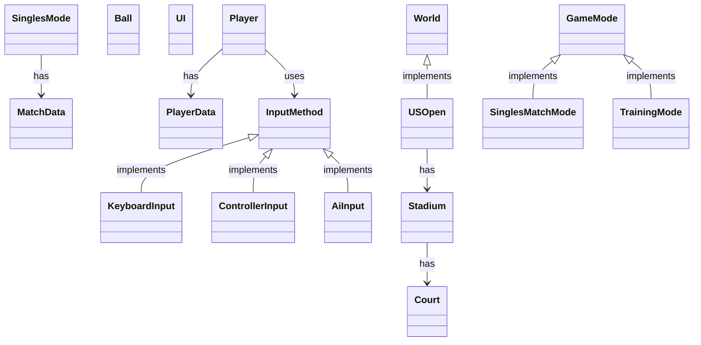

```mermaid
classDiagram


    class Player {
    }

    class PlayerData {
    }

    class Ball {
    }


    class UI {
    }

    class MatchData {
    }

    class USOpen {
    }

    class Stadium {
    }

    class Player {
    }

    class AiInput {
    }

    class Court {
    }

    class World {
    }

    class SinglesMode {

    }
    
    class GameMode {

    }

    Player --> PlayerData : has
    Player --> InputMethod : uses
    InputMethod <|-- KeyboardInput : implements
    InputMethod <|-- ControllerInput : implements
    InputMethod <|-- AiInput : implements

    World <|-- USOpen : implements

    GameMode <|-- SinglesMatchMode : implements
    GameMode <|-- TrainingMode : implements
    SinglesMode --> MatchData : has
    USOpen --> Stadium : has
    Stadium --> Court : has
```
