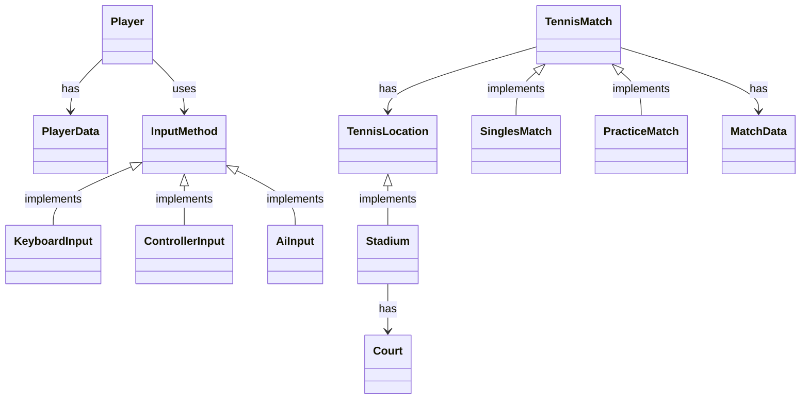

```mermaid
classDiagram


    class Player {
    }


    Player --> PlayerData : has
    Player --> InputMethod : uses
    InputMethod <|-- KeyboardInput : implements
    InputMethod <|-- ControllerInput : implements
    InputMethod <|-- AiInput : implements

    TennisMatch --> TennisLocation : has

    TennisMatch <|-- SinglesMatch : implements
    TennisMatch <|-- PracticeMatch : implements
    TennisMatch --> MatchData : has
    
    TennisLocation <|-- Stadium : implements
    Stadium --> Court : has
```
