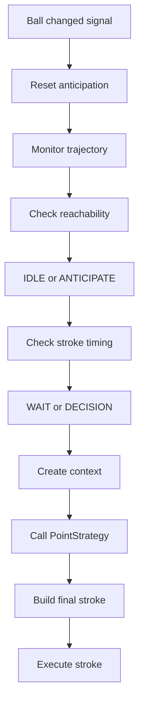
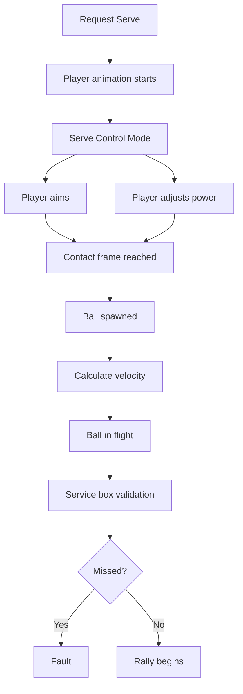
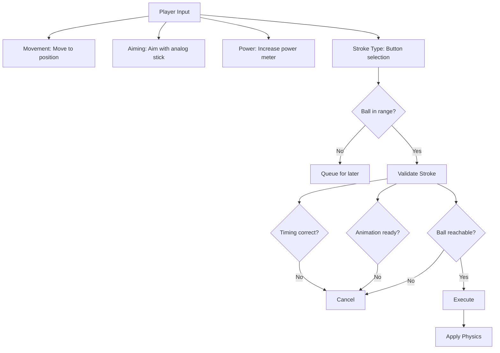

## Overview

Pelota uses two parallel control systems: **AI Controllers** for computer players and **Human Controllers** for user-controlled players. Both systems decide what strokes to execute and how to move on court.

## Controller Architecture

### Base Controller Class

Both AI and Human controllers inherit from `ControllerBase`:

```gdscript
class ControllerBase extends Node:
    var player: Player              # Reference to controlled player
    var _targeting_context: TargetingContext
    
    func request_move_to(position: Vector3) -> void:
        # Command player to move toward position
    
    func request_stroke(stroke: Stroke) -> void:
        # Command player to execute stroke
    
    func get_target_position(ball: Ball) -> Vector3:
        # Calculate optimal position to be in
```

### Controller Types

| Type | Purpose | Input | Decision Making |
|------|---------|-------|-----------------|
| **AIController** | Computer player | Game state | Deterministic algorithm |
| **HumanController** | Player character | Keyboard/gamepad | Player input |

## AI Controller System

### Overview

The AI controller autonomously plays tennis by:
1. Tracking ball position and trajectory
2. Predicting opponent's shots
3. Deciding optimal court position
4. Executing strokes with calculated power and targeting

### AI Decision Loop



### AI Phases

The AI controller maintains a state machine:

```gdscript
enum Phase {
    IDLE,              # Not involved
    ANTICIPATION,      # Tracking ball, preparing
    APPROACHING_BALL,  # Moving toward interception point
    WAITING_CONTACT,   # Ready to hit
    EXECUTING_STROKE   # Stroke animation playing
}
```

### AiPointContext

When making a decision, AI creates a context snapshot:

```gdscript
class AiPointContext extends RallyContext:
    var short_ball_opportunity: bool     # Ball is short (near net)
    var ball_side: BallSide              # FOREHAND or BACKHAND
    var selected_intent: ShotIntent      # NEUTRAL, ATTACK, DEFEND, etc.
    var shot_risk: float                 # [0.0, 1.0]
    var play_style: PlayStyleProfile     # Tactical configuration
```

**RallyContext Base Properties:**
- `player`, `opponent` references
- `player_position`, `opponent_position`, `ball_position` (Vector3)
- `incoming_ball_speed`, `ball_height`, `player_movement_speed`
- `player_stamina_ratio`, `opponent_center_distance`, `recovery_distance`
- `closest_step` (TrajectoryStep with ball trajectory data)
- `is_serve` flag

### PointStrategy

The strategy evaluator determines optimal shot selection:

```gdscript
class PointStrategy extends Node:
    func evaluate_stroke(context: AiPointContext) -> Stroke:
        # Analyze situation
        # Determine shot intent (attack, defend, neutral, etc)
        # Calculate power, spin, target
        # Return complete Stroke
```

**Key Decisions:**
1. **Shot Type**: Forehand, backhand, volley, drop shot, etc.
2. **Power Level**: Adjusted for situation and stamina
3. **Target Location**: Court position to aim for
4. **Spin Amount**: Topsin, backspin, sidespin magnitude
5. **Shot Intent**: Strategic goal (attacking vs defensive)

### Shot Intents

AI chooses intent based on situation:

```gdscript
enum ShotIntent {
    NEUTRAL,            # Standard rally shot
    ATTACK,             # Aggressive offensive shot
    DEFEND,             # Conservative defensive shot
    APPROACH_NET,       # Advance toward net after shot
    SERVE               # Service motion
}
```

**Intent Modifiers:**

| Intent | Power | Risk | Target |
|--------|-------|------|--------|
| NEUTRAL | Baseline | Medium | Maintain rally |
| ATTACK | High | High | Aggressive court area |
| DEFEND | Lower | Low | Safe area, deep |
| APPROACH_NET | Medium | High | Short with follow-up |
| SERVE | Max | High | Service box |

### AI Positioning Strategy

AI calculates optimal court position to cover opponent's possible shots:

```gdscript
# Angle bisector: position maximizing coverage
func _calculate_angle_bisector_position(opponent_hit_position: Vector3) -> Vector3:
    var opponent_xz = Vector3(opponent_hit_position.x, 0, opponent_hit_position.z)
    var distance_to_opponent = player.position.distance_to(opponent_hit_position)
    
    # Determines position covering both court angles
    var mid_point = (player.position + opponent_xz) / 2
    return mid_point  # Simplification; actual calculation more complex
```

## Human Controller System

### Input Processing

Human controllers translate player input into stroke decisions:

1. **Direction Input**: Analog stick or arrow keys → aim direction
2. **Power Input**: Hold button, increase meter → stroke power
3. **Stroke Type**: Button press → select forehand/backhand/etc
4. **Confirmation**: Release button → execute stroke

### Input Device Abstraction

```gdscript
class InputDevice:
    func set_serve_mode(enabled: bool) -> void:
        # Switch to serve-specific input handling
    
    func get_aimed_direction() -> Vector2:
        # Return current aiming direction
    
    func get_power_level() -> float:
        # Return current power (0.0 to 1.0)
```

### Stroke Validation

Before executing human stroke, validation checks:

```gdscript
func _validate_stroke_execution(stroke: Stroke) -> bool:
    # 1. Check ball is in play
    if not is_instance_valid(ball):
        return false
    
    # 2. Check timing (is ball close enough?)
    var distance = ball.global_position.distance_to(contact_point)
    if distance > hit_range_tolerance_meters:
        return false
    
    # 3. Check animations are ready
    if not _animation_ready():
        return false
    
    return true
```

### Serve Sequence (Human)



### Power Meter System

Human players build power through input:

```gdscript
var _current_power: float = 0.0
var _power_increment_rate: float = GameConstants.PACE_INCREMENT_RATE  # 0.15

# Each frame when button held
_current_power += _power_increment_rate * delta
_current_power = clampf(_current_power, 0.0, 1.0)

# Final power calculation
var actual_power = lerp(MIN_POWER, MAX_POWER, _current_power)
```

## Shot Execution System

### ShotExecution Class

The `ShotExecution` utility builds final stroke from AI or human input:

```gdscript
class ShotExecution extends RefCounted:
    func build_stroke(
        context: AiPointContext,
        targeting: TargetingContext
    ) -> Stroke:
        # 1. Determine stroke type
        # 2. Adjust power based on context
        # 3. Calculate spin components
        # 4. Compute target position
        # 5. Return complete Stroke
```

### Power Calculation

Base power is modified by multiple factors:

$$P_{\text{adjusted}} = P_{\text{base}} \cdot M_{\text{intent}} \cdot M_{\text{pace}} \cdot M_{\text{risk}} \cdot M_{\text{control}} \cdot M_{\text{stamina}}$$

Where:
- \(P_{\text{base}}\): Base power for stroke type (15-30 m/s)
- \(M_{\text{intent}}\): Multiplier for shot intent (0.8-1.3)
- \(M_{\text{pace}}\): Adjustment for match pace (0.9-1.1)
- \(M_{\text{risk}}\): Higher risk = lower power (0.8-1.0)
- \(M_{\text{control}}\): Fatigue effect on accuracy (0.8-1.02)
- \(M_{\text{stamina}}\): Player tiredness (0.76-1.0)

**Example Calculation:**
```
Base: 20 m/s
Intent (ATTACK): x1.2 = 24 m/s
Pace (fast rally): x0.95 = 22.8 m/s
Risk (medium): x0.9 = 20.5 m/s
Control (fresh): x1.0 = 20.5 m/s
Stamina (80%): x0.98 = 20.1 m/s
Final: 20.1 m/s
```

### Spin Calculation

Spin is calculated per stroke type with player skill modifiers:

```gdscript
func _compute_spin(
    stroke_type: Stroke.StrokeType,
    normalized_target: Vector2,
    context: AiPointContext,
    play_style: PlayStyleProfile,
    intent: AiPointContext.ShotIntent,
    risk: float
) -> Vector3:
    var stats = _stats(context)
    
    # Direction-based spin
    var side_sign = sign(normalized_target.x)  # Cross-court or down-line
    
    # Retrieve skill factors
    var topspin_skill = stats.spin_control01(stroke_type, context.player_stamina_ratio)
    var sidespin_tendency = play_style.sidespin_rate()
    
    # Apply modifiers for intent and risk
    var intent_spin_mod = _intent_spin_multiplier(intent)
    
    # Build spin vector
    var side_spin = side_sign * sidespin_tendency * risk * intent_spin_mod
    var top_spin = _calculate_topspin_magnitude(stroke_type, topspin_skill, risk)
    var forward_spin = _calculate_forward_spin(stroke_type, risk)
    
    return Vector3(side_spin, top_spin, forward_spin)
```

## Targeting System

### Target Selection

AI or human selects court position to aim for:

**Typical Targets (in court coordinates):**

```gdscript
# Baseline shots
var baseline_center = Vector3(0.0, 1.5, 12.0)
var baseline_sideline = Vector3(4.0, 1.5, 12.0)

# Mid-court
var mid_court = Vector3(1.0, 2.0, 8.0)

# Net approach
var short_ball = Vector3(2.0, 0.8, 2.0)

# Service return (from receiver perspective)
var service_return_target = Vector3(0.0, 1.5, 12.0)

# Serve targets (server perspective)
var serve_t_box = Vector3(0.0, 1.0, 6.4)
var serve_ad_box = Vector3(3.0, 1.0, 6.4)
```

### Trajectory Prediction for Targeting

Ball physics predicts where ball will land given target:

```gdscript
# Given target position, calculate required velocity
var required_velocity = ball.calculate_velocity(
    stroke_position,    # Where ball is contacted
    target_position,    # Where we want it to land
    velocity_z,         # Z velocity constraint
    spin_vector         # Spin to apply
)
```

The iterative solver adjusts X and Y velocity to hit target.

## Play Style Profiles

AI players have configurable play styles:

```gdscript
class PlayStyleProfile:
    var aggression: float           # [0.0, 1.0] - risk taking tendency
    var defensive_tendency: float   # Preference for defensive shots
    var net_play_freq: float        # How often approach net
    var sidespin_rate: float        # Cross-court vs down-line preference
    var pace_preference: float      # Fast vs slow rally preference
```

**Profile Examples:**
- **Aggressive**: High aggression (0.8), medium defense, frequent net play
- **Defensive**: Low aggression (0.3), high defense, rare net play
- **Balanced**: Medium values (0.5) across all dimensions

## Decision Flow Diagram

### AI Decision Making

```mermaid
flowchart TD
    A[Ball Arrives in Court] --> B[_on_ball_changed() Signal]
    B --> C[Initialize Anticipation]
    C --> D[Each Frame: Check Ball Position]
    D --> E{Too far?}
    D --> F{Moving to position?}
    D --> G{Close enough?}
    E -- Yes --> H[IDLE]
    F -- Yes --> I[APPROACHING]
    G -- Yes --> J[READY]
    J --> K{Ball predictable?}
    K -- No --> L[Wait more]
    K -- Yes --> M[Create Context]
    M --> N[Evaluate Context\nPlayer stamina, court position, ball velocity, opponent position, shot success]
    N --> O[Call PointStrategy\nIntent, stroke type, power, spin, target]
    O --> P[Build Final Stroke]
    P --> Q[Execute Stroke]
    Q --> R[Animation + Physics]
```

### Human Decision Making



## Performance Considerations

### AI Complexity

Different AI difficulty levels:

| Level | Context Updates | Decision Frequency | Perfect Accuracy |
|-------|-----------------|-------------------|-----------------|
| Beginner | Every 0.5s | Every stroke | ~60% |
| Intermediate | Every 0.2s | Every stroke | ~80% |
| Expert | Every frame | Every stroke | ~95% |

### Trajectory Prediction

Prediction only computed when needed:
- When AI deciding stroke
- When human aiming with prediction display
- When trajectory changes significantly

This prevents excessive computation during rallies.
