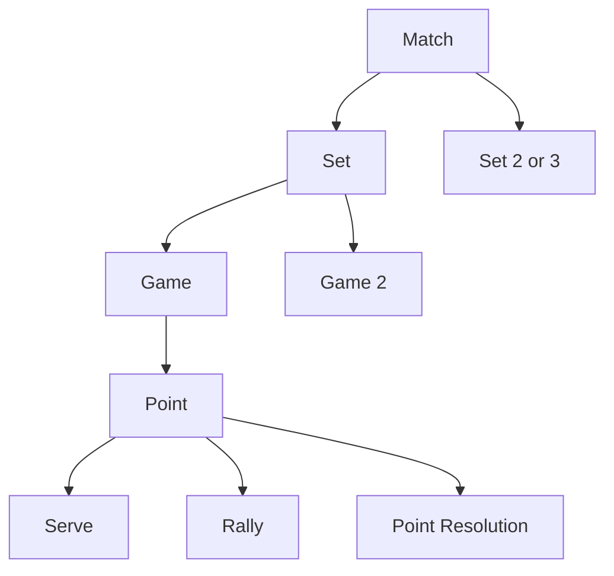
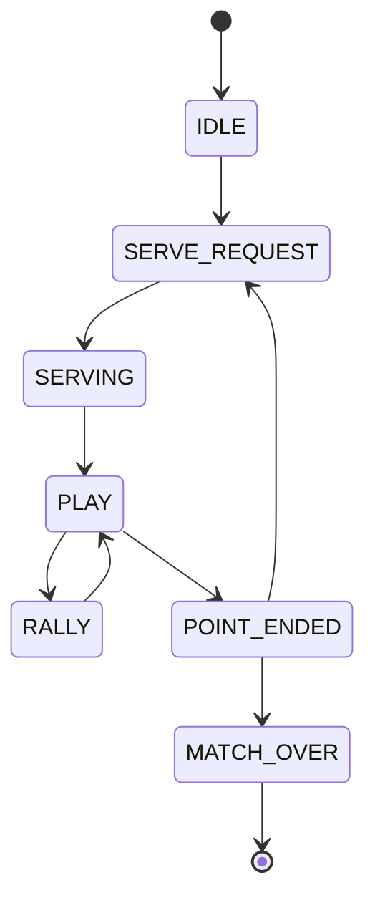
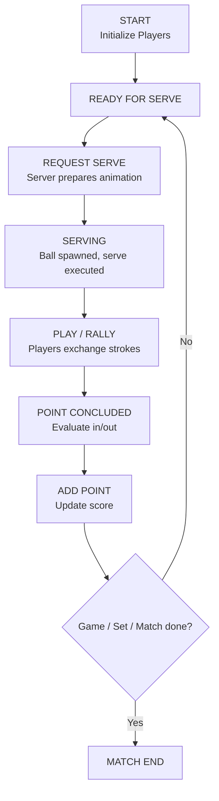

## Overview

A Pelota match is organized hierarchically from the highest level (full match) down to individual strokes. The match progression follows standard tennis rules adapted for the game engine.

## Match Hierarchy



## Match State Machine

The `MatchManager` maintains match state through distinct phases:

### MatchState Enum

```gdscript
enum MatchState {
    IDLE,        # No match in progress
    SERVE_REQUEST,  # Waiting for serve to be requested
    SERVING,     # Server preparing and executing serve
    PLAY,        # Active rally in progress
    POINT_ENDED, # Point decided, processing score
    MATCH_OVER   # Match concluded
}
```

### State Transitions



## Point Structure

### Phases Within a Point

Each point progresses through distinct phases managed by `MatchLifecycleBus`:

```gdscript
enum Phase {
    IDLE,           # Initial state
    WAITING_SERVE,  # Awaiting serve
    SERVING,        # Server in serve motion
    RALLY,          # Active rally
    POINT_ENDED     # Point decided
}
```

### Serve

The serve initiates every point:

1. **Serve Request**: `MatchManager` requests serve from server
2. **Toss Animation**: Server animation plays (ball tossed into air)
3. **Ball Spawn**: At animation keyframe, ball spawned at toss height
4. **Serve Execution**: Racket contacts ball during animation
5. **In-Play**: Ball travels toward service box

**Service Box Rule:**
- Ball must land in service box (dimensions: 6.4m deep, 4.118m wide)
- If first serve misses: **First Fault**
- If second serve misses: **Double Fault** (point to receiver)
- If serve succeeds: Rally begins

**Serve Power Range:**
- Minimum: 8.0 m/s
- Maximum: 36.0 m/s
- Typical AI serves: 30-35 m/s

### Rally

Once serve is in play, rally proceeds with alternating strokes:

1. **Receiver's Turn**: Opponent moves to intercept ball
2. **Stroke Decision**: Player AI or human controller decides:
   - Shot type (forehand, backhand, volley, etc.)
   - Power level
   - Target location
   - Spin amount
3. **Stroke Execution**: 
   - Animation plays
   - Racket contacts ball at keyframe
   - Ball velocity calculated based on stroke attributes
4. **Ball In Flight**: Trajectory prediction runs for next player
5. **Repetition**: Steps 1-5 repeat until point concludes

### Rally Conclusion

A rally ends when:

1. **Ball Out of Bounds**: Lands outside court boundary
2. **Net Contact**: Ball touches net (out of play)
3. **Double Bounce Violation**: Server returns ball before it bounces
4. **Failed Return**: Receiver can't reach ball or serves into net
5. **Winner**: Uncatchable shot (ace or winner)

## Scoring System

### Point Scoring

Standard tennis point progression:

| Points | Score | Notation |
|--------|-------|----------|
| 0 | 0 | Love |
| 1 | 15 | Fifteen |
| 2 | 30 | Thirty |
| 3 | 40 | Forty |
| 3-3 | 40-40 | Deuce |
| 4-3 | Advantage Server | Ad Server |
| 3-4 | Advantage Receiver | Ad Receiver |
| 4+ | Game | Won after 2 pt lead from Deuce |

### Deuce Rules

- When score reaches 3-3 (40-40): **Deuce**
- Next point win: **Advantage**
- Advantage player scores next: **Game**
- Opponent scores from Advantage: Back to **Deuce**

### Game Scoring

First player to 4 points (with at least 2-point lead) wins game.

- Score progression: 0 → 15 → 30 → 40 → Game
- Exception: Tied at 3-3 (Deuce) requires 2-point lead

### Set Scoring

First player to win 6 games (with at least 2-game lead) wins set.

- Typical progression: 6-0, 6-1, 6-2, etc.
- If tied 5-5: Must win 7-5
- If tied 6-6: **Tiebreak** (often played)

### Tiebreak (Optional)

When games are tied 6-6:
- First player to 7 points (min 2-point lead) wins tiebreak
- Tiebreak winner wins set 7-6

### Match Scoring

Typically best of 3 or 5 sets:
- **Best of 3**: First to win 2 sets
- **Best of 5**: First to win 3 sets (common in professional play)

## MatchManager Architecture

### Core Responsibilities

The `MatchManager` orchestrates match flow:

```gdscript
class MatchManager extends Node:
    @export var player0: Player          # First player
    @export var player1: Player          # Second player
    @export var ball: Ball               # Game ball
    @export var court: Court             # Court reference
    @export var stadium: Stadium         # Arena environment
    
    var current_state: MatchState        # Current phase
    var state_history: Array[MatchState] # State progression log
    var last_hitter: Player              # Track who last hit ball
```

### Key Methods

| Method | Purpose |
|--------|---------|
| `_ready()` | Initialize players, court, signals |
| `start_match()` | Begin match, first serve |
| `request_serve()` | Ask server to serve |
| `add_point(winner: Player)` | Award point to winner |
| `update_score()` | Recalculate game/set score |
| `end_point()` | Process point completion |
| `end_match()` | Match conclusion |

### Match Flow State Diagram



## Stroke Execution

### Stroke Data

Each stroke carries attributes:

```gdscript
class Stroke extends Resource:
    enum StrokeType {
        FOREHAND,
        FOREHAND_DROP_SHOT,
        BACKHAND,
        BACKHAND_SLICE,
        BACKHAND_DROP_SHOT,
        VOLLEY,
        SERVE,
    }
    
    var stroke_type: StrokeType
    var stroke_power: float              # 8.0 to 36.0 m/s
    var stroke_spin: Vector3             # (sidespin, topspin, forward)
    var stroke_target: Vector3           # Target court position
    var intended_stroke_power: float     # Pre-modification power
    var intended_stroke_target: Vector3  # Pre-modification target
    var step: TrajectoryStep             # Closest ball trajectory point
    var delay: float                     # Animation start delay (seconds)
```

### Stroke Types

#### Groundstrokes (Forehand/Backhand)
- **Power Range**: 15-30 m/s
- **Typical Spin**: \((0.15, 0.5, 0.3)\) (topspin)
- **Trajectory**: Forward and upward arc
- **Use**: Rally, returning serve

#### Slice/Backspin Strokes
- **Power Range**: 12-25 m/s
- **Typical Spin**: \((0.2, -8.2, -0.65)\) (backspin)
- **Trajectory**: Lower arc, floaty feel
- **Use**: Defensive rallies, slowing down pace

#### Volley
- **Power Range**: 8-20 m/s
- **Typical Spin**: \((0.08, -0.65, 0)\) (minimal spin)
- **Trajectory**: Downward into court
- **Use**: Offensive play at net

#### Serve
- **Power Range**: 25-36 m/s
- **Typical Spin**: \((0.3, 0.8, 0.4)\) (varied)
- **Trajectory**: Fast and direct
- **Use**: Initiate points

#### Drop Shot
- **Power Range**: 3-8 m/s
- **Typical Spin**: \((0.1, -10.0, -1.0)\) (heavy backspin)
- **Trajectory**: Short distance with high arc
- **Use**: Forcing opponent to net

## Ball Validity Rules

### Out of Bounds

Ball is out if landing position outside court:

```gdscript
var court_width = 8.11
var court_depth = 26.0
var half_width = court_width / 2

var is_out = (
    abs(landing_pos.x) > half_width or
    abs(landing_pos.z) > court_depth / 2
)
```

### Net Contact

Ball hitting net during rally is **out** (dead ball).

### Serve Rules

Serve-specific validity:
- Must land in service box (first serve)
- Service box: \(|x| \leq 4.118\) m, \(0 < z \leq 6.4\) m
- If out: Fault (counts toward double fault)

### Double Bounce Rule

After serve lands:
- Receiver must return before ball bounces again
- Exception: Serve is receiver's turn regardless

## Player Stamina Impact

Stamina affects match progression:

### Stamina Properties

| Property | Effect |
|----------|--------|
| **Stamina Depletion** | Executing strokes costs stamina |
| **Power Reduction** | Lower stamina → reduced shot power |
| **Speed Penalty** | Court movement speed decreases |
| **Recovery** | Stamina regenerates between points |

### Fatigue Calculation

```gdscript
var fatigue_factor = player.get_stamina_ratio()
var power_multiplier = lerpf(0.76, 1.0, fatigue_factor)
var adjusted_power = base_power * power_multiplier
```

A fatigued player (20% stamina) executes shots at ~76% power vs fresh player.

## Timeline for Typical Rally

| Event | Time | Duration |
|-------|------|----------|
| Serve Request | 0.0 s | - |
| Serve Animation | 0.0-1.5 s | 1.5 s |
| Ball in Flight | 1.5-2.0 s | 0.5 s |
| Receiver Moves | 1.5-2.5 s | 1.0 s |
| Receiver Shot | 2.5-3.0 s | 0.5 s |
| Server Returns | 3.0-4.5 s | 1.5 s |
| Rally Exchanges | 4.5+ s | Variable |
| Point Ends | N/A | Rally dependent |
| Point Reset | N/A | 3.0 s |

A typical rally lasts 15-45 seconds depending on rally length.
